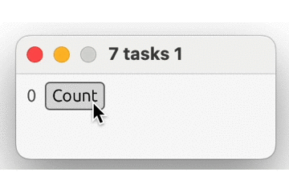
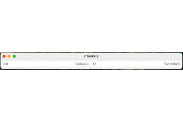

# rust-egui-seven-tasks - doing the classic seven tasks for guis

## The 7 Tasks

Eugen Kiss has defined 7 tasks that you should accomplish in the gui of your choice so that you really get to know them.

https://eugenkiss.github.io/7guis/tasks/

I decided to go this way with Rust and egui(https://github.com/emilk/egui).

## task 1 .. first.rs

A simple counter

<br><br><br><br><br><br><br><br><br><br><br><br><br><br>

## task 2 .. second.rs

Temperature Converter

<br><br><br><br><br><br><br><br><br><br><br><br><br><br>


```Rust

```
